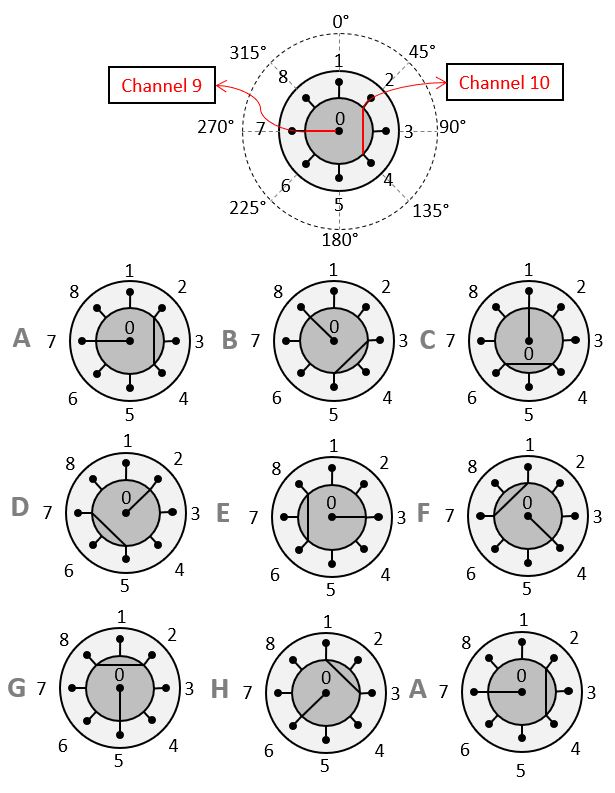

# Valve logic implemented

This section is specially built for some users who want to add new valves to the packages devices. As the valve is the 
most complex device implemented in the package, it is essential to understand the logic before adding devices of the 
same kind.

The valve logic, or better specifically, the rotary valve logic, is based on the device's movement and degree of 
freedom. The figure above illustrates an example of a valve. The rotary valve has 2 parts. 
The first part, called stator, is fixed and contains the ports, where the tubes are connected. The second part, 
called the rotor, is mobile. The rotor can rotate to a specific angle to eastablish a specific connection. 

In the figure, the systematic numbering of the nine ports, from 0 to 8, ensures a clear understanding of their relation to 
the central port. The first port, number 1, is always the highest, and the subsequent ports are numbered in a clockwise
direction.



Two lists are essential to create the connections according to the rotor and stator. The `stator_ports` 
is the list of the available connection ports. The `rotor_ports` is the list of connecting channels on the rotor. The example above corresponds to position A illustrated in the figure.

```python
stator_ports=[(1, 2, 3, 4, 5, 6, 7, 8), (0,)],
rotor_ports=[(None, None, 10, None, 10, None, None, 9), (9,)]
```

Observe that the second tuple of both lists correlates with the central port, number zero. The 
`rotor_ports` states that ports 3 and 5 are connected and ports 7 and 0 are connected.

Following the logic, with a rotation of +45 degrees in the rotor, only the `rotor_ports` is shifted. Then, the 
new configuration, or position B, as illustrated in the figure, will be:
```python
stator_ports=[(1, 2, 3, 4, 5, 6, 7, 8), (0,)],
rotor_ports=[(9, None, None, 10, None, 10, None, None), (9,)]
```


Position C will be:
```python
stator_ports=[(1, 2, 3, 4, 5, 6, 7, 8), (0,)],
rotor_ports=[(None, 9, None, None, 10, None, 10, None), (9,)]
```
And position D is:

```python
stator_ports=[(1, 2, 3, 4, 5, 6, 7, 8), (0,)],
rotor_ports=[(None, None, 9, None, None, 10, None, None), (9,)]
```
Imagine if we have a injection valve with 2 positions and 6 ports, as shown above.


The configuration of these two positions, according to the logic, will be:

For position A:
```python
stator_ports=[(1, 2, 3, 4, 5, 6), (None,)],
rotor_ports=[(7, 8, 8, 9, 9, 7), (None,)]
```

For position B:
```python
stator_ports=[(1, 2, 3, 4, 5, 6), (None,)],
rotor_ports=[(7, 7, 8, 8, 9, 9), (None,)]
```


## Philosophy

1. **Philosophy of Explicit Connection Specification**:
- It's important to explicitly specify which ports to connect in a valve system for clarity and precision. It is 
  done through `rotor_ports` variable.

2. **Simple Multiposition Valves**:
- In basic valves, the central port is always open and connects to the selected port. 

3. **Complex Valves**:
- Complex rotors, like those with injection valves, benefit from clear commands like `connect((1, 2))`, which simplifies 
the connection process.
- Specifying which ports should not connect is crucial, particularly during switching operations. If the is a port that
can not be connected, the user should define it as `None`. For example, if the valve illustrated in the last figure, 
  the port 6 is not connectable, the user can define the configuration as:
```python
stator_ports=[(1, 2, 3, 4, 5, None), (None,)],
rotor_ports=[(6, 7, 7, 8, 8, 6), (None,)]
```
Observe that what should be the port 6, receive a `None`.

4. **Hamilton Valves Challenge**:
- Hamilton valves often have positions that connect three ports, making it difficult to predict the outcomes of commands.
- Using straightforward commands like `connect((1, 2))` helps in managing these valves effectively.

5. **Definitions Needed for Clarity**:
- **Port Zero**: This port may or may not exist. If it does, it is on the turning axis and is always open.
- **Port One**: Located at the topmost position on the physical valve. If there is no port directly on top, the first 
port in a clockwise direction is port one.
- **None Ports**: These are logical ports representing dead-ends, essential for defining non-connectable positions. 
They are immutable, meaning the rotor or stator has no opening there.
- **Mutable Dead-ends**: Represented by blanking plugs, which need to be defined by the user since they could be open 
on the valve side.

6. **Graph Representation of Valves**:
- Valves are represented as graphs where connections (edges) are defined by port numbers. If a port does not connect, 
it is set to `None`. This is particularly necessary for valves like the Hamilton, where the rotor has more open 
positions than the stator.

7. **Valve Orientation**:
- The discussed logic applies to valves oriented with their front side facing the user. However, some equipment like 
autosamplers might have a valve oriented differently (e.g., with the always open port facing the ground), in which 
case the valve should be reoriented mentally for consistency.
